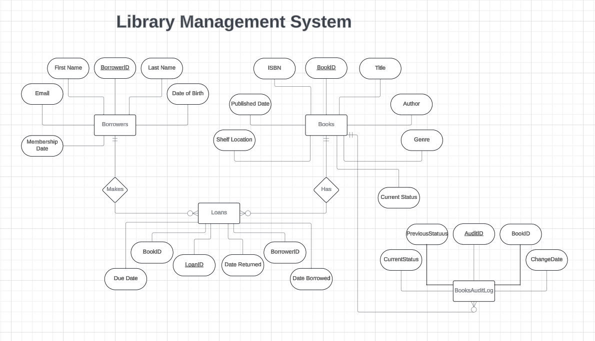

# 📚 Library Management System Database Task 📚

## **Background**:

 A local library wishes to transition from their traditional book-keeping to a more robust digital system. They want a platform to efficiently track books, borrowers, loans, returns, and offer insights into borrowing trends.

## **Objective**:

Design and implement a relational database using MS SQL that supports the library's operations and offers extensive querying capabilities.

## **Requirements**:

### **1. Design an Entity Relationship Model (ERM) Diagram**

### **2. Design the Relational Schema using MS SQL**

### **3. Build and Seed the Database**

### **4. Complex Queries and Procedures**

1. **List of Borrowed Books**: Retrieve all books borrowed by a specific borrower, including those currently unreturned.
2. **Active Borrowers with CTEs**: Identify borrowers who've borrowed 2 or more books but haven't returned any using CTEs.
3. **Borrowing Frequency using Window Functions**: Rank borrowers based on borrowing frequency.
4. **Popular Genre Analysis using Joins and Window Functions**: Identify the most popular genre for a given month.
5. **Stored Procedure - Add New Borrowers**:
    - **Procedure Name**: **`sp_AddNewBorrower`**
    - **Purpose**: Streamline the process of adding a new borrower.
    - **Parameters**: **`FirstName`**, **`LastName`**, **`Email`**, **`DateOfBirth`**, **`MembershipDate`**.
    - **Implementation**: Check if an email exists; if not, add to **`Borrowers`**. If existing, return an error message.
    - **Return**: The new **`BorrowerID`** or an error message.
6. **Database Function - Calculate Overdue Fees**:
    - **Function Name**: **`fn_CalculateOverdueFees`**
    - **Purpose**: Compute overdue fees for a given loan.
    - **Parameter**: **`LoanID`**
    - **Implementation**: Charge fees based on overdue days: $1/day for up to 30 days, $2/day after.
    - **Return**: Overdue fee for the **`LoanID`**.
7. **Database Function - Book Borrowing Frequency**:
    - **Function Name**: **`fn_BookBorrowingFrequency`**
    - **Purpose**: Gauge the borrowing frequency of a book.
    - **Parameter**: **`BookID`**
    - **Implementation**: Count the number of times the book has been issued.
    - **Return**: Borrowing count of the book.
8. **Overdue Analysis**: List all books overdue by more than 30 days with their associated borrowers.
9. **Author Popularity using Aggregation**: Rank authors by the borrowing frequency of their books.
10. **Genre Preference by Age using Group By and Having**: Determine the preferred genre of different age groups of borrowers. (Groups are (0,10), (11,20), (21,30)…)
11. **Stored Procedure - Borrowed Books Report**:
    - **Procedure Name**: **`sp_BorrowedBooksReport`**
    - **Purpose**: Generate a report of books borrowed within a specified date range.
    - **Parameters**: **`StartDate`**, **`EndDate`**
    - **Implementation**: Retrieve all books borrowed within the given range, with details like borrower name and borrowing date.
    - **Return**: Tabulated report of borrowed books.
   
    
12. **Trigger Implementation**
- Design a trigger to log an entry into a separate **`AuditLog`** table whenever a book's status changes from 'Available' to 'Borrowed' or vice versa. The **`AuditLog`** should capture **`BookID`**, **`StatusChange`**, and **`ChangeDate`**.
13. **SQL Stored Procedure with Temp Table**:
- Design a stored procedure that retrieves all borrowers who have overdue books. Store these borrowers in a temporary table, then join this temp table with the **`Loans`** table to list out the specific overdue books for each borrower.

## **LMS ERM**:

## **Database seeding**:
I used the data_generator.py script to generate fake consistent data for the database in the form of CSV files. Then, I utilized these generated CSV files — 'books.csv', 'borrowers.csv', and 'loans.csv' — to seed the database. You can watch the YouTube video available at the following link: https://www.youtube.com/watch?v=14FpoXKTEJw to help you in the seeding process.
